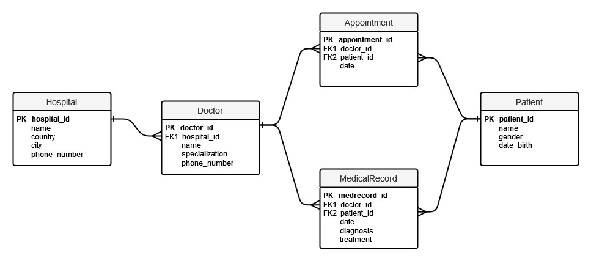

# Hospital Management System

Тема проекту для лабораторних робіт: Система з менеджменту лікарень та лікарів

## Посилання по документу
- [Таблиця з учасниками проекту](docs/teams.md)
- [API документація (таблиця з основними роутами)](#api-документація-таблиця-з-основними-роутами)
- [Діаграми](#діаграми)
- [Скрипти](#скрипти)
- [Інструкції щодо встановлення та запуску проекту](#інструкції-щодо-встановлення-та-запуску-проекту)

## API документація (таблиця з основними роутами)

| HTTP method | URL                       | Description                       |
|-------------|---------------------------|-----------------------------------|
| GET         | /dashboard                | Show dashboard                    |
| GET         | /users/sign_in            | Create a new user session         |
| POST        | /users/sign_in            | Save user session                 |
| DELETE      | /users/sign_out           | Delete user session               |
| GET         | /users/password/new       | Create a new user password        |
| GET         | /users/password/edit      | Edit user password                |
| PATCH/PUT   | /users/password           | Update user password              |
| POST        | /users/password           | Save user password                |
| GET         | /users/cancel             | Cancel user registration          |
| GET         | /users/sign_up            | Sign up a new user                |
| GET         | /users/edit               | Edit user data                    |
| PATCH       | /users                    | Update user data                  |
| DELETE      | /users                    | Delete user                       |
| POST        | /users                    | Create a new user                 |
| GET         | /hospitals                | View list of hospitals            |
| POST        | /hospitals                | Create a new hospital             |
| GET         | /hospitals/new            | Create a new hospital             |
| GET         | /hospitals/:id/edit       | Edit hospital                     |
| GET         | /hospitals/:id            | View hospital information         |
| PATCH/PUT   | /hospitals/:id            | Update hospital information       |
| DELETE      | /hospitals/:id            | Delete hospital                   |
| GET         | /doctors                  | View list of doctors              |
| POST        | /doctors                  | Create a new doctor               |
| GET         | /doctors/new              | Create a new doctor               |
| GET         | /doctors/:id/edit         | Edit doctor                       |
| GET         | /doctors/:id              | View doctor information           |
| PATCH/PUT   | /doctors/:id              | Update doctor information         |
| DELETE      | /doctors/:id              | Delete doctor                     |
| GET         | /patients                 | View list of patients             |
| POST        | /patients                 | Create a new patient              |
| GET         | /patients/new             | Create a new patient              |
| GET         | /patients/:id/edit        | Edit patient                      |
| GET         | /patients/:id             | View patient information          |
| PATCH/PUT   | /patients/:id             | Update patient information        |
| DELETE      | /patients/:id             | Delete patient                    |
| GET         | /appointments             | View list of appointments         |
| POST        | /appointments             | Create a new appointment          |
| GET         | /appointments/new         | Create a new appointment          |
| GET         | /appointments/:id/edit    | Edit appointment                  |
| GET         | /appointments/:id         | View appointment information      |
| PATCH/PUT   | /appointments/:id         | Update appointment information    |
| DELETE      | /appointments/:id         | Delete appointment                |
| GET         | /medical_records          | View list of medical records      |
| POST        | /medical_records          | Create a new medical record       |
| GET         | /medical_records/new      | Create a new medical record       |
| GET         | /medical_records/:id/edit | Edit medical record               |
| GET         | /medical_records/:id      | View medical record information   |
| PATCH/PUT   | /medical_records/:id      | Update medical record information |
| DELETE      | /medical_records/:id      | Delete medical record             |
| GET         | /                         | root                              |

## Діаграми

ER-діаграма:

## Скрипти
Перелік та опис

## Інструкції щодо встановлення та запуску проекту

1. Завантажити код проекту з репозиторію:

`git clone https://github.com/LizaGrebenyk/RubyHospitals.git`

2. Перейти до папки з проектом та запустити Docker-контейнер:

`docker-compose up -d`

3. Встановити геми:

`docker-compose run app bundle install`

4. Виконати міграції бази даних:

`docker-compose run app rails db:migrate`

Після цих кроків проект має бути доступний за посиланням http://localhost:3000/.
